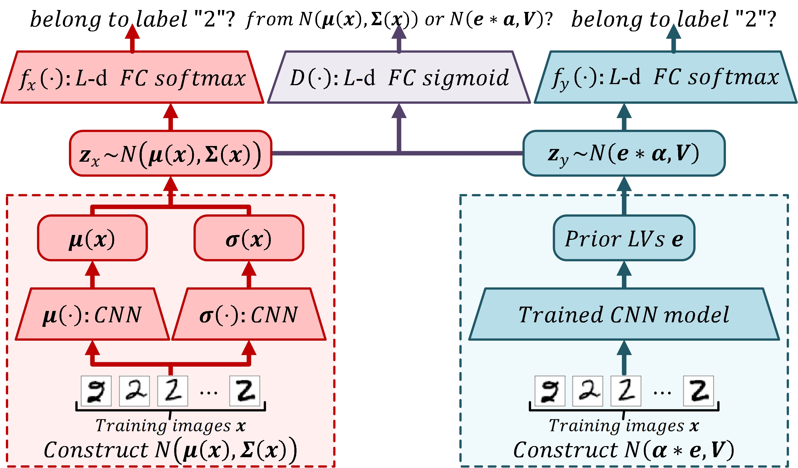
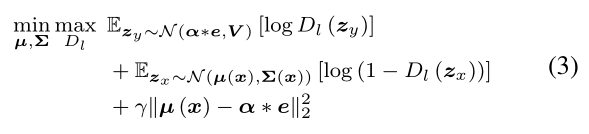
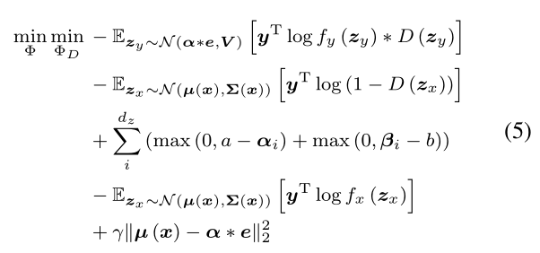

# This is the source file of the paper [A Latent Variables Augmentation Method Based on Adversarial Training for Image Categorization with Insufficient Training Samples](https://www.researchgate.net/publication/344251212_A_Latent_Variables_Augmentation_Method_Based_on_Adversarial_Training_for_Image_Categorization_with_Insufficient_Training_Samples)

## Framework of the Lagat
The framework of the Lagat is as follows. 


We can optimze the following two objective functions alternatively.






## Configuration of the Lagat method 
1. The twin CNN can be set as general deep model, including but not limited the ResNet, ResNet+AutoAugment, Inception and so on
2. The advised search interval of $a$ is $[1, 3.5]$; the advised search interval of $b$ is $[0.1, 1.5]$.
3. The prior LV is usually set as the variable generated by the global average pooling layer and the LV and the prior LV are of the same dimension. Moreover, the prior LV can set as variables from the other layer, but we have not tried it yet. 
## Requirement
The required packages are in the [requirement.txt][requirement.txt].

The source data set must be saved in the folders as follows:
```python
cifar10_dir = os.path.abspath('.') + '/Dataset/Cifar/cifar-10-batches-py/'
cifar100_dir = os.path.abspath('.')  + '/Dataset/Cifar/cifar-100-python/'
mnist_dir = os.path.abspath('.')  + '/Dataset/Mnist/'
stl10_dir = os.path.abspath('.')  + '/Dataset/STL-10/'
tinyimagenet_dir = os.path.abspath('.')  + '/Dataset/TinyImagenet/'
```
People who want to run the Lagat with other number of training sample should prepare the original data set and extract the source data into the corresponding folder. The ```Mydataset``` model will transform the data set. 

The preprocessed data files can be downloaded from [google Drive ](https://drive.google.com/drive/folders/1SiTSwT2Iolps_1ibIOomGUsYfCIOmaDC?usp=sharing).
## Training
The configuration of Lagat is set in the [config.py][config.py]. 

Here, we take the CIFAR10 data set as an example to present how to train a Lagat model. For the situation:
```math
data set = CIFAR10
#Training sample = 500
a = 1.50
b = 1.00
CNN = ResNet + AutoAugment
```
the corresponding command is :
```bash
python main.py --dataset CIFAR10 --train_num 500 --a 1.5 --b 1.00 --ResNet_blocks ResNet_AA
```
For the situation:
```math
data set = MNIST
#Training sample = 1000
a = 1.25
b = 0.50
CNN = ResNet + AutoAugment
```
the corresponding command is :
```bash
python main.py --dataset MNIST --train_num 1000 --a 1.25 --b 0.50 --ResNet_blocks ResNet_AA
```

Tpis: we have implemented ResNet+AA, and save the trained ResNet+AA model in folder called [AA_Model][AA_Model]. The files in this folder is named as ```%s_%d_z_x % (dataset, train_num)``` and ```%s_%d_y_z % (dataset, train_num)``` where ```z_x``` denotes the CNN model and ```y_z``` denotes the fully connected layer. 


[AA_Model]:[./AA_Model]
[config.py]:[./config.py]
[requirement.txt]:[./requirement.txt]

